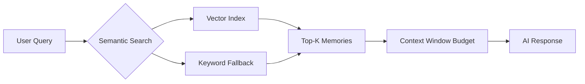
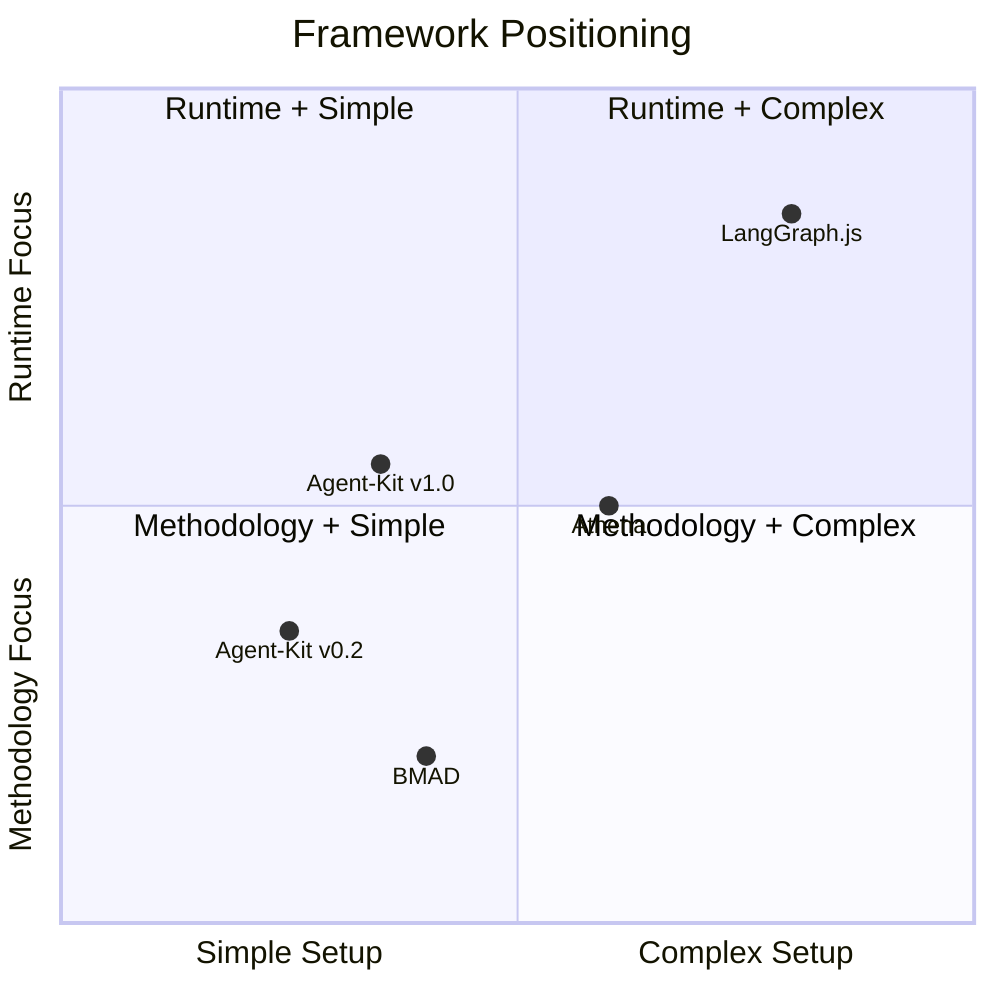
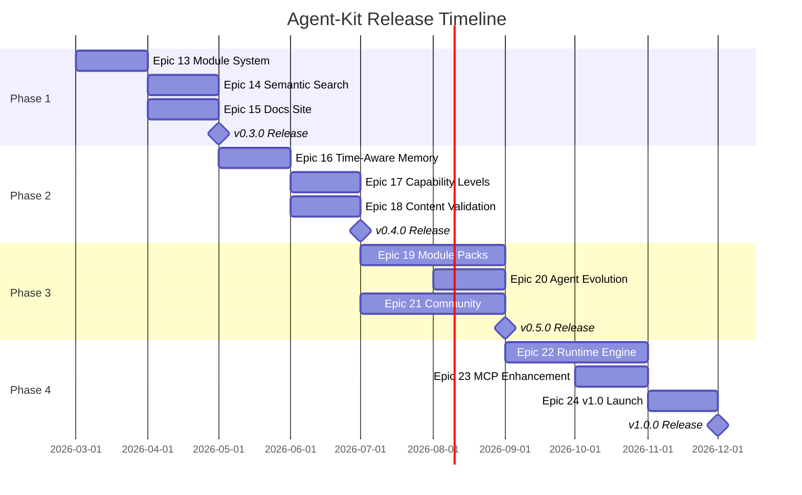

# Agent-Kit Roadmap 2026

> Based on competitive analysis vs **Athena** (memory OS), **LangGraph.js** (graph orchestration), **BMAD** (agile methodology).

> [!IMPORTANT]
> Current version: **v0.2.8** (24 skills, 14 agents, 283 tests, 14 CLI commands)

---

## Phase 1: Foundation (v0.3.x) — Q1 2026

> Goal: **Module system + Docs site + Semantic search**
> Timeline: 3-4 sprints

### Epic 13: Module Architecture ⏳ (In Progress)
| Story | Description | Status |
|-------|-------------|--------|
| 13-1 | Manifest generation (4 CSVs) | ✅ Done |
| 13-2 | `/akit-tutorial` guided walkthrough | ✅ Done |
| 13-3 | Module architecture (`module.yaml`, registry, loader) | 📋 Planned |
| 13-4 | `agent module install/list/remove` CLI | 📋 Planned |
| 13-5 | Agent customization (`.customize.yaml`) | 📋 Planned |
| 13-6 | Module-help routing | 📋 Planned |

### Epic 14: Semantic Memory Search
> Inspired by: **Athena** (vector embeddings, semantic clustering)

| Story | Description | Effort |
|-------|-------------|--------|
| 14-1 | Integrate embedding provider (OpenAI/local Ollama) | M |
| 14-2 | Vector index for `.agent/memories/` | M |
| 14-3 | `agent memory search "query"` with semantic ranking | S |
| 14-4 | Auto-cluster related memories | L |
| 14-5 | Context window management (2K→10K→20K like Athena) | M |



### Epic 15: Documentation Site
> Inspired by: **BMAD** (docs.bmad-method.org), **Athena** (extensive docs/)

| Story | Description | Effort |
|-------|-------------|--------|
| 15-1 | Docs site scaffold (VitePress/Docusaurus) | S |
| 15-2 | Getting Started tutorial (with GIFs) | M |
| 15-3 | API reference (auto-generated from JSDoc) | M |
| 15-4 | Skill/workflow catalog page | S |
| 15-5 | Architecture decision records | S |

---

## Phase 2: Intelligence (v0.4.x) — Q2 2026

> Goal: **Time-awareness + Capability levels + Content validation**
> Timeline: 3-4 sprints

### Epic 16: Time-Aware Memory
> Inspired by: **Athena** (session compounding, temporal reasoning)

| Story | Description | Effort |
|-------|-------------|--------|
| 16-1 | Add `createdAt`, `lastAccessed`, `accessCount` to memory frontmatter | S |
| 16-2 | Temporal queries: "What did we decide about X last week?" | M |
| 16-3 | Memory decay scoring (stale memories flagged) | S |
| 16-4 | Session history timeline (`agent history`) | M |
| 16-5 | Decision audit trail (who decided what, when) | M |

### Epic 17: Capability Levels & Governance
> Inspired by: **Athena** (6 constitutional laws, 4 capability levels)

| Story | Description | Effort |
|-------|-------------|--------|
| 17-1 | Define 4 autonomy levels (L1-L4) in RULES.md | S |
| 17-2 | Per-skill capability requirements | S |
| 17-3 | Human-in-the-loop gates for L3+ operations | M |
| 17-4 | Audit log for autonomous decisions | M |
| 17-5 | User-configurable trust boundaries | S |

**Capability Levels:**
```
L1: Read-only     → can read files, answer questions
L2: Guided        → can write files with user approval  
L3: Autonomous    → can execute multi-step workflows
L4: Self-directed → can create new workflows, modify config
```

### Epic 18: Content Validation Framework
> Inspired by: **BMAD** (validate-prd, check-implementation-readiness)

| Story | Description | Effort |
|-------|-------------|--------|
| 18-1 | Memory quality validator (completeness, format, staleness) | M |
| 18-2 | Output artifact validator (PRD structure, story format) | M |
| 18-3 | `agent validate` CLI command | S |
| 18-4 | Pre-publish checklist skill (`/akit-validate`) | M |
| 18-5 | Quality scoring dashboard in `agent status` | S |

---

## Phase 3: Ecosystem (v0.5.x) — Q3 2026

> Goal: **Community + First-party modules + Agent evolution**
> Timeline: 4-5 sprints

### Epic 19: First-Party Module Packs

| Module | Skills | Agents | Target Users |
|--------|--------|--------|-------------|
| `akit-module-fullstack` | Next.js pages, NestJS APIs, DB migrations | Luna, Atlas, Petra | Full-stack devs |
| `akit-module-devops` | Docker, CI/CD, GitHub Actions, monitoring | Docker, Shield | DevOps engineers |
| `akit-module-testing` | E2E scaffold, test design, coverage review | Quinn (enhanced) | QA engineers |
| `akit-module-design` | UX research, component design, accessibility | Sally (enhanced) | UI/UX designers |
| `akit-module-data` | Analytics setup, KPI tracking, A/B testing | Metrics (enhanced) | Data analysts |

### Epic 20: Agent Evolution
> Inspired by: **Athena** (self-improving profiles after 1100+ sessions)

| Story | Description | Effort |
|-------|-------------|--------|
| 20-1 | Agent performance tracking (which agents help most?) | M |
| 20-2 | Agent style learning from user corrections | L |
| 20-3 | Auto-suggest new agents based on project patterns | M |
| 20-4 | Agent knowledge base (per-agent learned patterns) | L |

### Epic 21: Community & Distribution

| Story | Description | Effort |
|-------|-------------|--------|
| 21-1 | Create Discord server with channels | S |
| 21-2 | npm module publishing pipeline for community modules | M |
| 21-3 | Module marketplace/registry (like npm but for skills) | L |
| 21-4 | Example project templates (Next.js + NestJS starter) | M |
| 21-5 | Contributing guide + module development template | S |

---

## Phase 4: Platform (v1.0) — Q4 2026

> Goal: **Production-ready platform with cloud option**
> Timeline: 5-6 sprints

### Epic 22: Runtime State Machine
> Inspired by: **LangGraph.js** (StateGraph, checkpoints, interrupts)

| Story | Description | Effort |
|-------|-------------|--------|
| 22-1 | Runtime graph executor (beyond CLI-only) | XL |
| 22-2 | Checkpoint/resume for long-running workflows | L |
| 22-3 | Human-in-the-loop interrupts | M |
| 22-4 | Parallel node execution | L |
| 22-5 | Workflow visualization (terminal + web) | M |

### Epic 23: MCP Server Enhancement

| Story | Description | Effort |
|-------|-------------|--------|
| 23-1 | Full memory CRUD via MCP tools | M |
| 23-2 | Workflow execution via MCP | M |
| 23-3 | Agent invocation via MCP | M |
| 23-4 | Cross-IDE state sync | L |

### Epic 24: v1.0 Release

| Story | Description | Effort |
|-------|-------------|--------|
| 24-1 | API stability audit + semver commitment | M |
| 24-2 | Migration guide from v0.x | S |
| 24-3 | Performance benchmarks | M |
| 24-4 | Security audit | L |
| 24-5 | Launch blog post + demo video | M |

---

## Competitive Positioning Matrix



## Key Differentiators to Maintain

| Agent-Kit Strength | Keep/Enhance |
|-------------------|-------------|
| TypeScript-native (no Python) | ✅ Keep — unique selling point |
| Lightweight (8 deps) | ✅ Keep — fast install |
| 283+ tests | ✅ Enhance — target 500+ |
| Party mode | ✅ Enhance — add persistence, recordings |
| Graph orchestration | ✅ Enhance — add runtime engine |
| 2-min setup | ✅ Keep — fastest in category |

## Release Timeline


